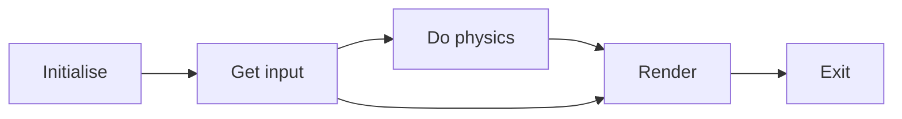

## Game Make-up Flow:

## subsyst interactive:
-   graphics, 
-   game logic, 
-   user input

## chapt2: drawing in SDL
-   basics
-   src & dst rect
-   load & disp textures
-   SDL_image extension

## chapt6: data-driven design
-   loading xml using TinyXML lib
-   creating a Distributed Factory
-   loading obj dynamically using the factory and an XML file
-   parsing a state from an XML file
-   fitting everything together into the framework
